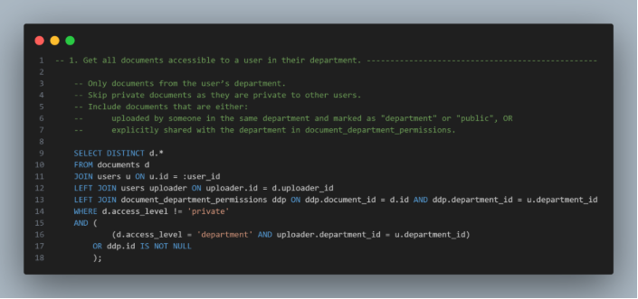

**Assessment Report**

Full-Stack Software Engineer Assessment

# Table of Contents

[Deliverable 1:](#_toc209378879)

[System Architecture:](#_toc209378880)

[Design Choices:](#_toc209378882)

[Deliverable 2:](#_toc209378883)

[Schema:](#_toc209378884)

[Backend overview and constraints:](#_toc209378885)

[SQL Queries](#_toc209378886)

[1. Get all documents accessible to a user in their department.](#_toc209378887)

[2. Get the 10 most recently uploaded documents tagged as Finance.](#_toc209378888)

[3. Find all versions of a given document (by document ID)](#_toc209378889)

[4. Get the number of documents uploaded by each department in the last 30 days.](#_toc209378890)

[Proof of Concept (POC) Project](#_toc209378891)

[Backend (API) Endpoints:](#_toc209378892)

[API Documentation:](#_toc209378893)

[Frontend:](#_toc209378894)

[Figma UI Design](#_toc209378895)

[Pages:](#_toc209378896)

[Deliverable 3:](#_toc209378897)

[GitHub Repo Link:](#_toc209378898)

[Video Link:](#_toc209378899)

# Deliverable 1:

## System Architecture:
##  
## Design Choices:
- **React + TS + Tailwind** → modern, flexible, rapid prototyping ,clean UI and components based architecture.
- **JWT Auth** → stateless, secure, well-suited for SPAs.
- **FastAPI** → lightweight, async-first, automatic API docs.
- **SQLite** → minimal setup, good for development & testing (we can then migrate to **PostgreSQL** in production)
- **Local FS** → free, no extra dependencies (we can then migrate to cloud based storage for production **(e.g. Amazon S3)** to be more reliable and scalable)
# Deliverable 2:

## Schema:

### Backend overview and constraints:

**Access Control Model**

The system enforces **multi-layered access control** to documents:

1. **User Roles (global) (admin & user)** (we can add super admin in the future)
1. **Department Membership**
1. **Document-Level Permissions**

Each layer refines who can view documents.

**1. User Roles**

- Users are assigned one role (users.role\_id → roles table).
- **Default roles identified in the system**:
  - **Admin**: Full access to all documents and operations (create/update/delete users, departments, roles).
  - **User**: Can create and manage documents they own and documents accessible to their department or explicit permissions.
- **Role enforcement**:
  - Certain endpoints require get\_current\_admin\_user to authorize admin-only operations.
  - Role-based restrictions are applied globally before checking document-specific permissions.

**2. Department Membership**

- Each user belongs to a department (users.department\_id → departments).
- Documents can have an access\_level:
  - **public**: Accessible to all authenticated users.
  - **department**: Only users in the same department as the uploader can access.
  - **private**: Restricted to the creator user or explicit users via document-level permissions.
- Departments can also be granted **document-level overrides** via the DocumentDepartmentPermission table.
- Example:
  - A document with access\_level='department' uploaded by Finance is visible to Finance department users.
  - Legal department can be explicitly granted access via DocumentDepartmentPermission.

**3. Document-Level Permissions**

- **Explicit granted control** through two tables:
  - **DocumentUserPermission**:
    - Maps user\_id → document\_id with permission.
    - Overrides general access rules for specific users.
  - **DocumentDepartmentPermission**:
    - Maps department\_id → document\_id with permission.
    - Overrides general department-based access.
- Example:
  - Document marked as private:
    - Only users in document\_user\_permissions or the uploader can access it.
  - Document marked as department:
    - Users in the department can access by default.
    - Additional departments can be granted access through document\_department\_permissions.

**4. Access Decision Flow**

When a user requests a document (can\_access\_document helper):

1. **Check global role**:
   1. If user.role.name == "admin" → grant full access.
1. **Check document access\_level**:
   1. public → allow.
   1. department → check if user.department\_id == document.uploader.department\_id.
      1. If not, check explicit document\_department\_permissions.
   1. private → only uploader or explicit document\_user\_permissions can access.
1. **Explicit permissions overrides**:
   1. Check DocumentUserPermission for user-specific access.
   1. Check DocumentDepartmentPermission for department-specific access.
1. **Otherwise** → deny access.

**5. Document Versions**

- **Versioning implemented via DocumentVersion table**:
  - Each document can have multiple versions.
  - Versions are tied to the uploader (uploaded\_by) and maintain version\_number.
  - Download and inline preview respect the same access control rules (can\_access\_document is reused).

**6. Tags**

- Documents can be tagged (Tag and DocumentTagLink tables).
- Tag-based search is integrated with access control (only returns documents the user can access).

**8. File Storage & Access**

- Uploaded documents stored in Documents/ folder with unique UUID filenames.
- Versions have separate files with version UUID.
- Downloads use FileResponse and respect access control.
- Inline viewing is supported via /documents/{doc\_id}/file or /versions/{version\_id}/file.

**9. Security Notes**

- Authentication via JWT (OAuth2PasswordBearer).
- Passwords hashed using hash\_password utility.
- Token expiration handled via settings.ACCESS\_TOKEN\_EXPIRE\_MINUTES.
- Admin-only operations explicitly enforced via get\_current\_admin\_user.
- All file access checks through can\_access\_document to prevent unauthorized downloads.

## SQL Queries

### 1. Get all documents accessible to a user in their department.

### 2. Get the 10 most recently uploaded documents tagged as Finance.

### 3. Find all versions of a given document (by document ID).

### 4. Get the number of documents uploaded by each department in the last 30 days.

# Proof of Concept (POC) Project

## Backend (API) Endpoints:

All the required endpoints [User registration & login, Upload document (store file + metadata), Search documents (by title, tags, uploader), View/download document, Fetch version history of a document.] are implemented and more endpoints.

All the required endpoints are integrated with the frontend and shown in the video.
###
### API Documentation:

## Frontend:

### Figma UI Design
Started with Figma design for pages layout and choosing the color palette for themes.

**Note:**\
All the frontend components and pages are fully responsive to handle different screen sizes and have dark and light themes handled

### Pages:

**1. Login Page**

- Form with email + password.
- On submit: sends credentials → gets token → saves to localStorage.
- Handles loading + error (“invalid email/password”).
- Link to register page.
- Redirect to the home page after login.

**2. Register Page**

- Form with email, password, full name, and department selector.
- Fetches department list from backend.
- On submit: creates user → stores token.
- Handles loading + errors.
- Link to login page.
- Redirect to the home page after registering.

**3. Documents Page**

- Lists user’s documents in a grid.
- Each card: preview (image/pdf/placeholder), title, description, and “Open” button.
- Handles loading, empty state, and failed previews.

**4. Document Detail Page:**

- Shows one document with metadata, tags, and versions.
- Preview latest version (PDF/image/none).
- Switch between versions.
- Download versions and upload new versions.
- Add new tags.
- Upload new version modal.

**5. Upload Document Page:**

- Form with title, description, access level, tags, and file upload.
- Drag & drop or browse file.
- On submit: uploads doc + attaches tags.
- Redirects to detail page after success.

**6. Search Page:**

- Search bar + filter (title/tags/uploader).
- Paginated results.
- Each result: title, description, access level, open button, quick download latest version.
- Shows loading, empty, and results states.
# Deliverable 3:

## GitHub Repo Link: 

<https://github.com/OsamaElHattab/Document-Repository>

## Video Link:

<https://drive.google.com/drive/folders/1rhynOEa1RElwSJ5TEJ_YL5ogLGW7vQ80?usp=sharing>

